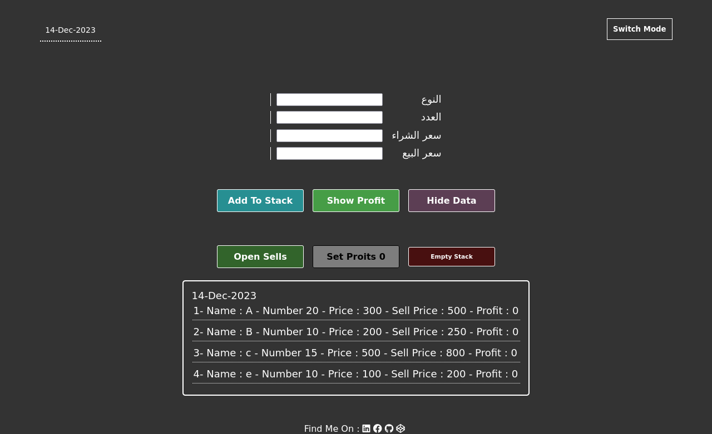
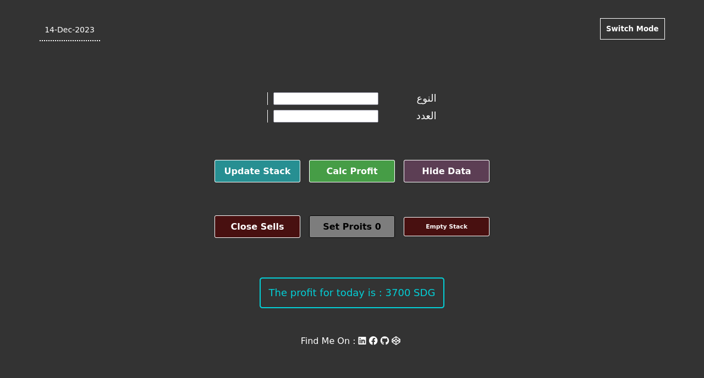
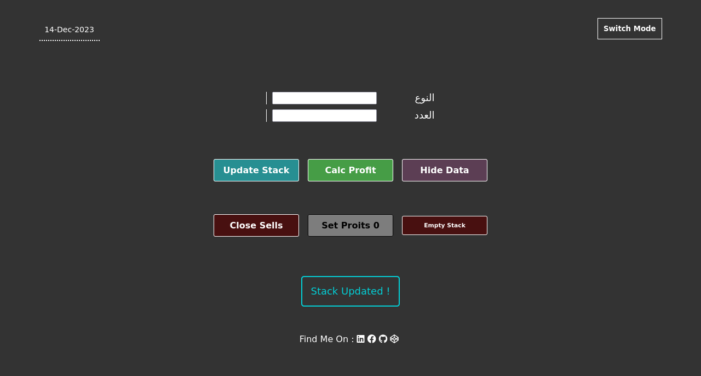
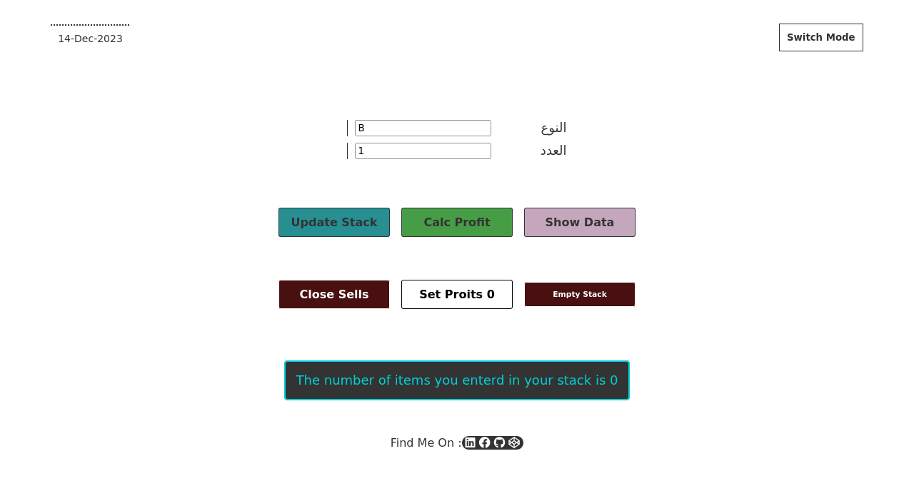
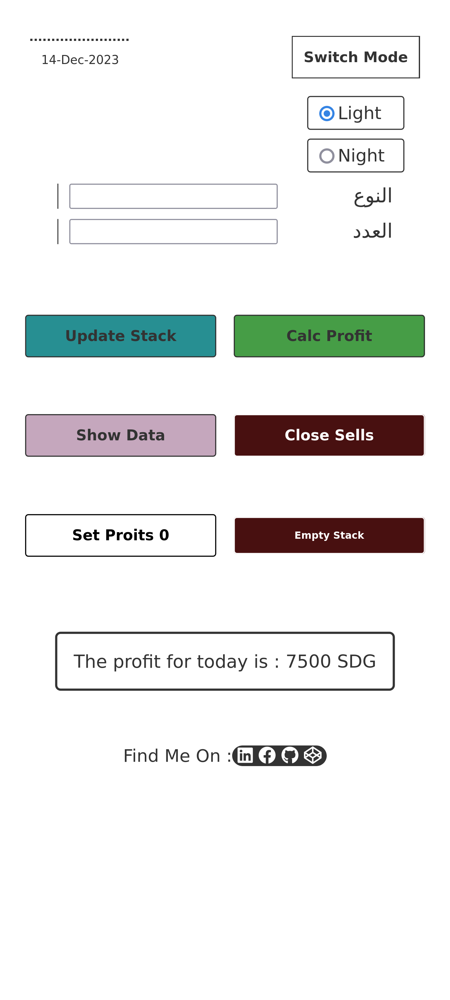

# 7essAbAt Web Application

#### 7essabat in Arabic mean (Calculations)
*******
###  7essAbAt is a web application build with:
- HTML5
- CSS3 (SASS preprocessor)
- Vanilla JavaScript

#### It's built to calculate the profits for small personal business.

#### The app is installable which mean is a Progressive Web Application (PWA) which can run on Mobile offline,you only need internet to open the app.

******
# Basic App Functions

1. Add item to stack with its name,number of item,price and Sell price.

2. Update stack if you sold one of your products

3. calculate profit 

4. Remove all data in stack

# Advanced Features
1. Light & Night Themes

2. Show & hide Data in stack

3. Open sells window.

4. Set all profits to zero in case something went wrong or you want to calc every single day's profit alone.

5. show error message if you enter words in numeric fields.

6.  Show message if you try to calc profit for item which has 0 number.

# screenshots

### Desktop :
-------
#### Data

******
#### Calc Profit

********
#### Sells Window

*********
#### If you try to calc zero item

********
#### Pop up to be ensure if you really want to clear your stack

********
### Mobile

## Future Development :

1. Enanche UI and make it more friendly.

2. Add option to remove specific item (not All Stack)

    